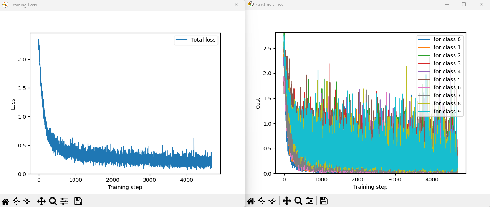
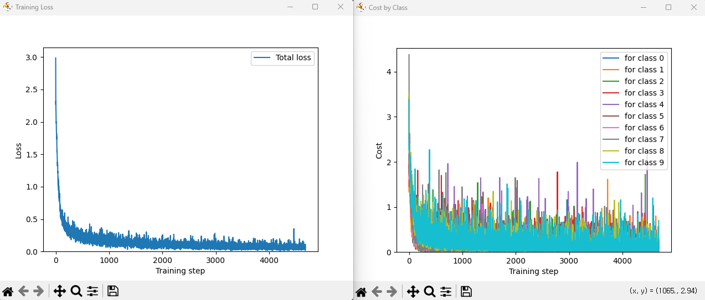

# Neural-Network

This repository contains the MLP and CNN implementations for the 2026 Computer Vision class.

The goal of this assignment is to first implement an MLP and then extend it to two-dimensional input processing, ultimately building a CNN.

The models are trained and evaluated on the MNIST handwritten digit classification dataset.


## Task1 - MLP


**최종 Accuracy: 94.31%**

```python
F = [perceptron(28*28, 256), perceptron(256, 256), perceptron(256, 10, True)]
```

MNIST 데이터를 이용하여 3-layer MLP를 학습함
학습이 진행됨에 따라 전체 Loss와 클래스별 Cost가 감소하는 것을 확인함

전체 데이터에 대한 Loss는 학습이 진행됨에 따라 안정적으로 감소함. 
반면 클래스별 Cost는 상대적으로 변동성이 큰 점을 관찰할 수 있었음.

이는 각 mini-batch에 포함되는 클래스별 샘플 수가 적고, 클래스별 샘플 구성이 매번 무작위로 달라지기 때문이라고 판단함.

## Task2 - CNN


**최종 Accuracy: 97.99%**

MNIST 데이터를 이용하여 아래와 같은 구조의 CNN을 구현함.

합성곱 -> Max Pooling -> 합성곱 -> Max Pooling ->  출력층

```python
F = [perceptron(1, 32, 5), pooling(), perceptron(32, 64, 5), pooling(), perceptron(64, 10, 4, True)]
```

학습 결과 MLP에 비해서 더 빠르게 Cost가 수렴함을 확인함. 다만 클래스별 Cost의 변동성은 MLP와 마찬가지로 크게 나타났으며, 이는 mini-batch당 클래스별 샘플 수가 적기 때문으로 판단함.

하지만 원본 데이터인 MNIST 데이터 특성상 숫자가 여전히 사진의 가운데 위치해 있어서 위치 변화에 강건하다는 CNN의 특징을 제대로 확인하지 못한 점은 아쉬움으로 남음. 향후 테스트 이미지를 상하좌우로 이동시켜 평가하면 위치 변화에 대한 강건성을 비교할 수 있을 것으로 보임.

CNN을 구현하면서 두 가지 문제점에 부딪혔는데,

첫 번째 문제점은 커널을 np.random.rand로 초기화하였을 때 파라미터가 발산하는 것으로, 이 문제는 평균이 0인 정규분포를 사용하는 np.random.randn으로 변경하여 양수와 음수가 균형 있게 포함되도록 하였을 때 해결되는 것을 관찰함. 

두 번째 문제점은 파라미터의 업데이트 스케일링을 맞추는 것으로, 합성곱에서는 하나의 커널 파라미터가 여러 공간적 위치의 출력 계산에 반복해서 사용됨. 따라서 역전파 시 동일한 파라미터에 영향을 주는 모든 출력 위치의 gradient를 더해서 해당 파라미터의 최종 gradient를 구해야 함. 기존에는 weight 업데이트를 (h*w)로 나누고 bias는 mean으로 평균하고 있었는데, 이를 weight와 bias 모두 위치에 대한 합으로 통일하였음.  이 결과 학습의 수렴 속도가 빨라지는 모습을 확인함.

